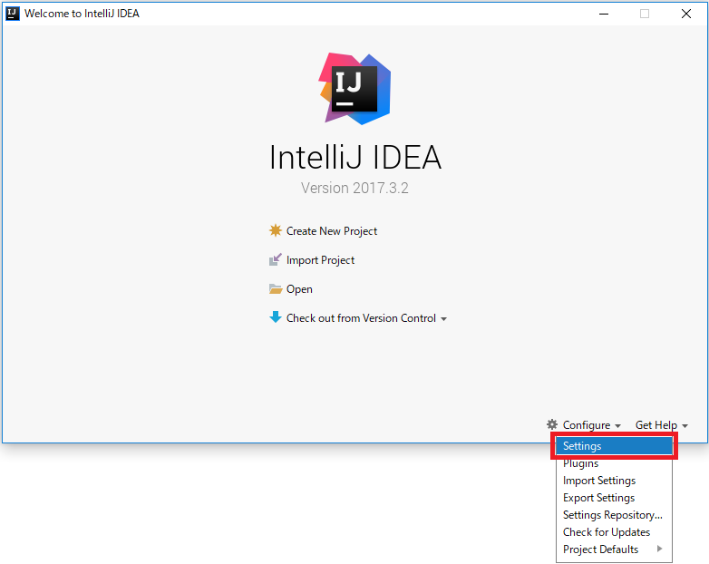
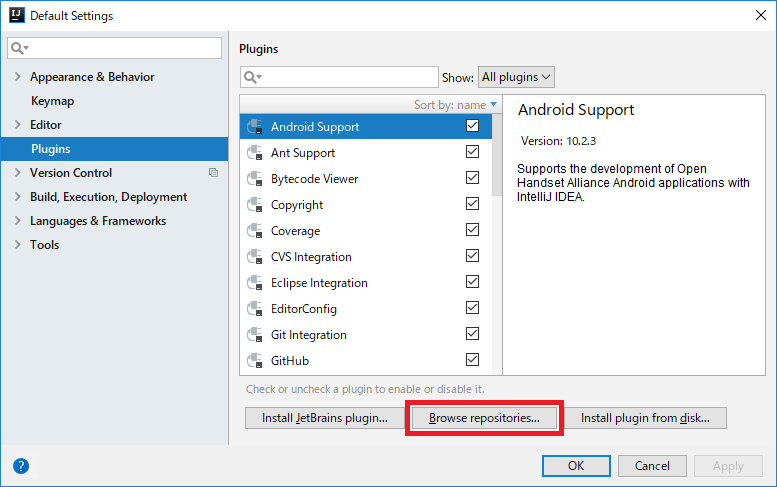
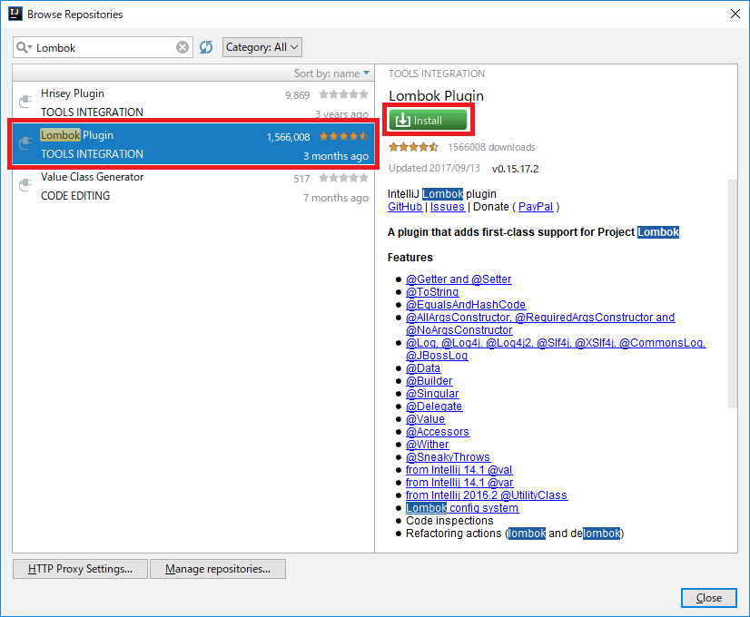

# IntelliJのインストール(Mac)

## 前提条件

* [Terminalを起動](tipsForMac.md#terminalの起動方法)して `java -version` とコマンドを入力した時、結果が返ってきますか？
* [Terminalを起動](tipsForMac.md#terminalの起動方法)して `mvn --version` とコマンドを入力した時、結果が返ってきますか？

## インストール

1. https://www.jetbrains.com/idea/#chooseYourEdition のDOWNLOADボタンから、**Community** のバージョンを選んでダウンロードしてください。
1. ダウンロードできたインストーラーを起動して、表示される手順に従ってインストールを進めてください。よくわからない項目はそのままYESを選択してください。

IntelliJを日本語化したい場合は、[IntelliJ IDEA 日本語化 | Qiita](http://qiita.com/makoto2468/items/6abf614b82cab865b745)が参考になります。

## プラグインの設定

1. もし起動していなかったら `Finder` > `アプリケーション` からIntelliJを起動し、`Configure` > `Settings` を選択します。 

1. Settingsウィンドウが表示されるので、左のバーからPluginsを選択し、 `Browse repositories...` ボタンを押下します。 

1. 検索バーに `Lombok` と入力し、Lombok Pluginを選択します。
右側に表示されるInstallボタンを押下してください。 

